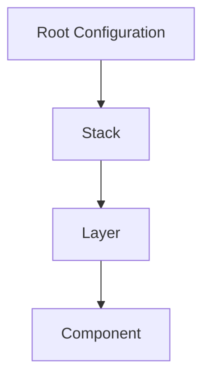

⚠️ **PRE-ALPHA NOTICE** ⚠️

🚧 This project is in a pre-alpha stage of development.

- Expect frequent changes
- API and configuration formats may undergo significant modifications
- Not recommended for production use
- Contributions and feedback are highly welcome!

---

# Terragrunt Reference Architecture V2

## 🚀 Quick Overview

A modular, scalable, and maintainable infrastructure management framework using Terragrunt, designed to simplify and standardize cloud infrastructure deployment across multiple environments.

## 🌟 Key Features

- **Centralized Configuration Management**
- **Multi-Provider Support**
- **Multi-Stack(s) Support**
- **Environment-Specific Configurations, and Automatic Secrets Injection**

## 📐 Architecture Principles

### Hierarchical Infrastructure Organization



## 🛠 Features & Capabilities

### 🔒 Centralized Configuration Management

- **Single Source of Truth**: Manage entire infrastructure through centralized YAML configurations
- **Environment-Specific Overrides**: Seamlessly customize configurations for different environments
- **DRY (Don't Repeat Yourself) Approach**: Reduce configuration redundancy and complexity

### 🌐 Multi-Provider Flexibility

- **Vendor-Agnostic Design**: Support for AWS, Azure, GCP, and more
- **Dynamic Provider Configuration**: Easily switch or integrate multiple cloud providers
- **Version Constraint Management**: Precise control over provider versions and compatibility

### 🚀 Infrastructure as Code (IaC) Optimization

- **Modular Stack Architecture**: Break down infrastructure into logical, manageable components
- **Hierarchical Configuration**: Root → Stack → Layer → Component organization
- **Reusable Infrastructure Components**: Create and share standardized infrastructure building blocks

### 🛡️ Advanced Configuration Management

- **Automatic Configuration Validation**
  - Comprehensive schema checking
  - Environment variable resolution
  - Secrets management
- **Intelligent Configuration Compilation**
  - Merge base and environment-specific configurations. Support multiple overrides.
  - Generate validated JSON configurations, through a compilation process that ensures that Terragrunt always receives a valid configuration.
  - Seamless Terragrunt integration. No side effects.

## 📦 Getting Started

### Prerequisites

- Terragrunt
- Terraform
- Go (for InfraCTL CLI)
- AWS CLI (or relevant cloud provider CLI)

### Quick Installation

```bash
# Clone the repository
git clone https://github.com/Excoraite/terragrunt-ref-arch-v2.git

# After you've configured your stack(s), layer(s) and component(s), you can run the following command to validate your configuration. E.g.:
just run-cli plan --target-env local --stack stack-datastore --layer db --component quota-generator

```

## 📚 Documentation

Explore our comprehensive documentation to understand the architecture and usage:

1. [Introduction](docs/01-introduction.md)

   - Project overview
   - Core concepts
   - Architecture principles

2. [Project Structure](docs/02-project-structure.md)

   - Repository organization
   - Directory layout
   - Configuration hierarchy

3. [Configuration System](docs/04-configuration-system.md)

   - Configuration management
   - Environment-specific settings
   - Compilation process

4. [Stack Management](docs/05-stack-management.md)

   - Infrastructure stack organization
   - Layer and component management
   - Provider integration

5. [InfraCTL CLI](docs/04-infractl-cli.md)
   - Command-line tool usage
   - Configuration validation
   - Infrastructure deployment commands

## 🤝 Contributing

1. Fork the repository
2. Create your feature branch
3. Commit your changes
4. Push to the branch
5. Create a Pull Request

## 📄 License

[Apache License 2.0](LICENSE)
