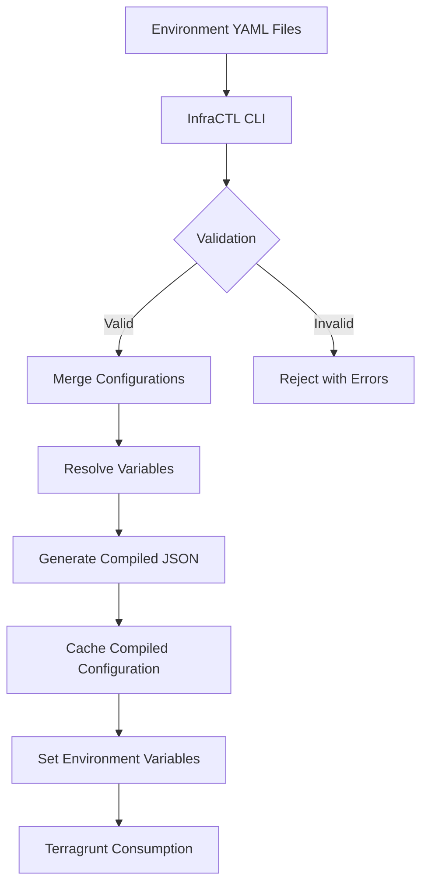
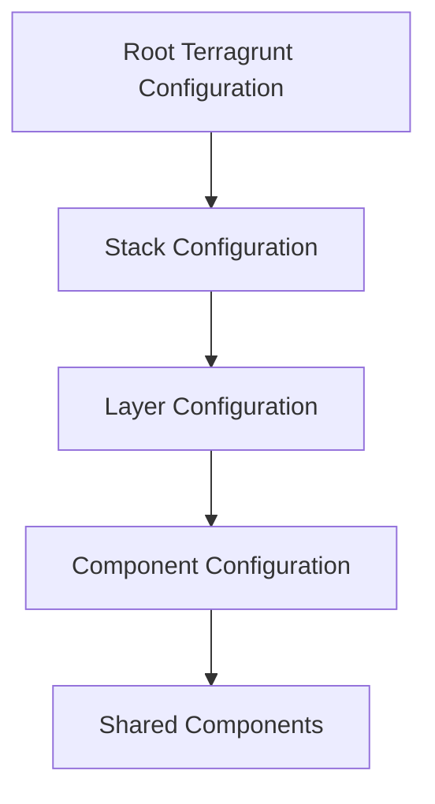

# Design Principles of Terragrunt Reference Architecture

## Overview

The Terragrunt Reference Architecture is built on two fundamental design principles:

1. Centralized Configuration Compilation
2. Keeping Terragrunt Configuration Clean and DRY (Don't Repeat Yourself)

## 1. Centralized Configuration Compilation

### Purpose

The configuration compilation process is designed to:

- Centralize infrastructure configuration
- Validate and merge environment-specific settings
- Provide a clean, consistent configuration for Terragrunt

### Compilation Workflow



### Configuration Flow Diagram


## 2. Keeping Terragrunt Configuration Clean and DRY

### Design Philosophy

- Minimize repetition in Terragrunt configurations
- Create a hierarchical, modular configuration structure
- Enable easy overrides and customization.
- Avoid side-effects in configuration files, by avoiding calling from terragrunt other binaries, scripts, etc.

### Configuration Hierarchy



### Inheritance Mechanism

```hcl
# Inheritance Flow
locals {
  # Root configuration
  root_config = read_terragrunt_config("${get_repo_root()}/terragrunt.hcl")

  # Stack configuration
  stack_config = read_terragrunt_config(find_in_parent_folders("stack.hcl"))

  # Layer configuration
  layer_config = read_terragrunt_config(find_in_parent_folders("layer.hcl"))

  # Component configuration
  component_config = read_terragrunt_config("${get_terragrunt_dir()}/component.hcl")
}

# Merged configuration
inputs = merge(
  local.root_config.inputs,
  local.stack_config.inputs,
  local.layer_config.inputs,
  local.component_config.inputs
)
```

### Shared Components Strategy

```
_shared/_components/
├── aws-networking.hcl
├── eks-cluster.hcl
└── dynamodb-table.hcl
```

Example of a Shared Component:

```hcl
# _shared/_components/aws-networking.hcl
locals {
  vpc_defaults = {
    cidr_block = "10.0.0.0/16"
    enable_dns_hostnames = true
    enable_dns_support = true
  }
}

inputs = {
  vpc_cidr = local.vpc_defaults.cidr_block
  enable_dns_hostnames = local.vpc_defaults.enable_dns_hostnames
}
```

### Benefits of This Approach

1. **Modularity**: Easy to add or modify infrastructure components
2. **Reusability**: Shared components can be used across different stacks
3. **Flexibility**: Environment-specific overrides are simple
4. **Maintainability**: Centralized configuration management

## Practical Example

### Directory Structure

```
infra/
├── terragrunt/
│   ├── _ENVS/
│   │   ├── base.yaml
│   │   └── local.yaml
│   ├── _shared/
│   │   └── _components/
│   │       └── aws-vpc.hcl
│   └── stack-platform/
│       ├── stack.hcl
│       └── networking/
│           ├── layer.hcl
│           └── vpc/
│               ├── component.hcl
│               └── terragrunt.hcl
└── tools/
    └── infractl/
```
