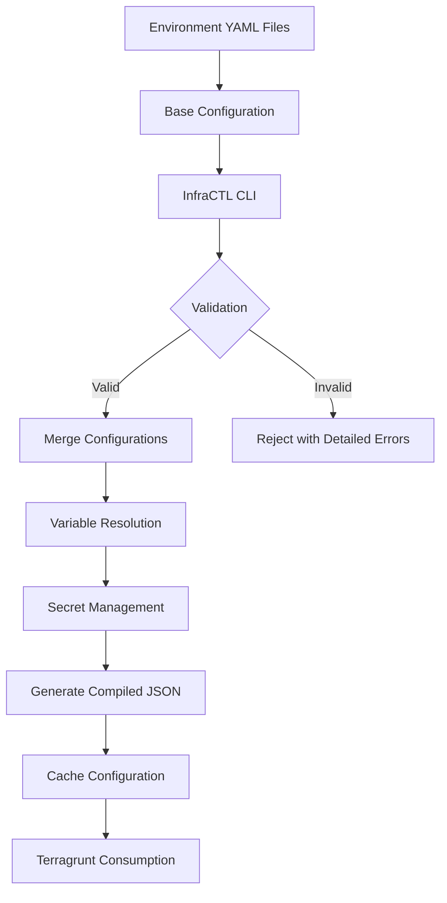

# Configuration System: Deep Dive

## Overview of Configuration Management

The configuration system is a structured approach to managing infrastructure configurations across different environments. It provides a centralized method of defining, validating, and deploying infrastructure components.

## Configuration Architecture



## Configuration File Structure

### 1. Root Configuration Section

```yaml
config:
  version: "1.0.0"
  last_updated: "2024-01-15"
  description: "Centralized configuration for local environment"
```

#### Purpose and Attributes

- **Version**: Configuration schema version
- **Last Updated**: Timestamp of last modification
- **Description**: Context about the configuration

### 2. Git Configuration

```yaml
git:
  base_url: "git::git@github.com:"
```

#### Features

- Define base Git URL for module sources

### 3. Product Configuration

```yaml
product:
  name: "ref-arch"
  version: "0.0.1-local"
  description: "Reference architecture for cloud infrastructure - demo environment"
  use_as_stack_tags: true
```

#### Capabilities

- Product-level metadata
- Option to use product details as stack tags

### 4. Infrastructure as Code (IaC) Configuration

```yaml
iac:
  versions:
    terraform_version_default: "1.9.8"
    terragrunt_version_default: "0.62.1"
  remote_state:
    s3:
      bucket: ${TF_STATE_BUCKET}
      lock_table: ${TF_STATE_LOCK_TABLE}
      region: "us-east-1"
```

#### Features

- Tool version specifications
- Remote state configuration for S3

### 5. Stacks Configuration

```yaml
stacks:
  - name: "stack-datastore"
    tags:
      stack_purpose: "demo-resource-generation"
    layers:
      - name: "db"
        tags:
          layer_type: "databases"
        components:
          - name: "id-generator"
            providers:
              - "random"
            tags:
              component_tag: "component-tag"
          - name: "aws-dynamodb-table"
            providers:
              - "aws"
            tags:
              component_tag: "component-tag"
```

#### Configuration Details

- Stack with layers and components
- Supports tagging at stack, layer, and component levels
- Provider specification for each component

### 6. Providers Configuration

```yaml
providers:
  aws:
    config:
      access_key_id: ${AWS_ACCESS_KEY_ID:-secrets.aws.access_key_id}
      secret_access_key: ${AWS_SECRET_ACCESS_KEY:-secrets.aws.secret_access_key}
      region: "us-east-1"
    version_constraints:
      - name: "aws"
        source: "hashicorp/aws"
        required_version: "5.80.0"
        enabled: true
  random:
    config: {}
    version_constraints:
      - name: "random"
        source: "hashicorp/random"
        required_version: "3.6.3"
        enabled: true
```

#### Provider Management

- Dynamic configuration with environment variable fallback
- Version constraints for providers
- Ability to enable/disable providers

### 7. Secrets Management

```yaml
secrets:
  aws:
    access_key: ${AWS_ACCESS_KEY_ID}
    secret_key: ${AWS_SECRET_ACCESS_KEY}
```

#### Secret Handling

- Environment variable-based secret injection
- Provider-specific secret configurations
