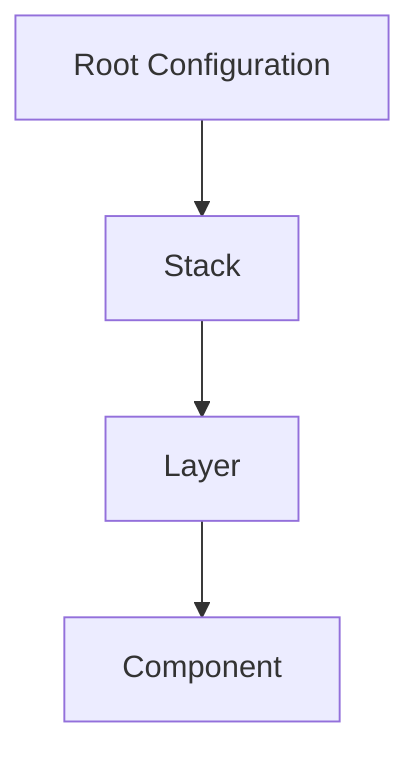
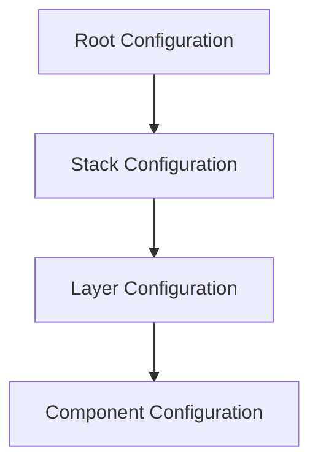

# Stack Management in Terragrunt Reference Architecture

## Overview

Stack management is a critical aspect of the Terragrunt Reference Architecture, providing a structured, modular approach to organizing and deploying infrastructure components. This document explains the hierarchical structure, configuration principles, and best practices for managing infrastructure stacks.

## Stack Hierarchy and Structure

### Conceptual Hierarchy



### Detailed Hierarchy Explanation

1. **Root Configuration**:

   - Global settings and defaults
   - Defines overarching infrastructure principles
   - Located in `infra/terragrunt/terragrunt.hcl`

2. **Stack**:

   - Represents a logical grouping of infrastructure resources
   - Corresponds to a specific domain or service
   - Located in `infra/terragrunt/stack-<name>`

3. **Layer**:

   - Subdivides a stack into logical segments
   - Represents a specific tier or functional group
   - Located in `infra/terragrunt/stack-<name>/<layer-name>`

4. **Component**:
   - Smallest deployable unit of infrastructure
   - Directly maps to a Terraform module
   - Located in `infra/terragrunt/stack-<name>/<layer-name>/<component-name>`

## Configuration Example

Let's break down a stack configuration from `local.yaml`:

```yaml
stacks:
  - name: "stack-datastore"
    tags:
      stack_purpose: "demo-resource-generation"
    layers:
      - name: "db"
        tags:
          layer_type: "databases"
        components:
          - name: "id-generator"
            providers:
              - "random"
            tags:
              component_tag: "component-tag"
          - name: "aws-dynamodb-table"
            providers:
              - "aws"
            tags:
              component_tag: "component-tag"
```

### Stack Configuration Breakdown

#### Stack Level

- **Name**: `stack-datastore`
  - Unique identifier for the stack
  - Follows a descriptive naming convention
- **Tags**:
  - `stack_purpose`: Provides context and categorization
  - Can be used for filtering, reporting, and organization

#### Layer Level

- **Name**: `db`
  - Represents a specific layer within the stack
  - Logically groups related components
- **Tags**:
  - `layer_type`: Describes the layer's purpose
  - Enables additional metadata and organization

#### Component Level

- **Name**:
  - `id-generator`: A component using the `random` provider
  - `aws-dynamodb-table`: A component using the `aws` provider
- **Providers**:
  - Explicitly define which providers are used
  - Must be declared in the `providers` section of the configuration
- **Tags**:
  - Component-specific metadata
  - Useful for tracking and managing individual components

## Provider Integration

### Provider Configuration

```yaml
providers:
  aws:
    config:
      access_key_id: ${AWS_ACCESS_KEY_ID:-secrets.aws.access_key_id}
      secret_access_key: ${AWS_SECRET_ACCESS_KEY:-secrets.aws.secret_access_key}
      region: "us-east-1"
    version_constraints:
      - name: "aws"
        source: "hashicorp/aws"
        required_version: "5.80.0"
        enabled: true
  random:
    config: {}
    version_constraints:
      - name: "random"
        source: "hashicorp/random"
        required_version: "3.6.3"
        enabled: true
```

### Provider Management Principles

- Each component must reference a provider
- Providers are configured centrally
- Version constraints ensure compatibility
- Ability to enable/disable providers

## Inputs and Configuration Inheritance

### Configuration Inheritance Mechanism



### Inputs Configuration

```yaml
stacks:
  - name: "stack-datastore"
    inputs:
      global_tag: "shared-tag"
    layers:
      - name: "db"
        inputs:
          layer_specific_input: "layer-value"
        components:
          - name: "aws-dynamodb-table"
            inputs:
              table_name: "example-table"
```

#### Inheritance Rules

- Inputs can be defined at stack, layer, and component levels
- Lower-level configurations can override higher-level inputs
- Enables flexible and granular configuration management

## Best Practices

1. **Modularity**:

   - Keep stacks, layers, and components focused and single-purpose
   - Promote reusability and maintainability

2. **Naming Conventions**:

   - Use descriptive, consistent names
   - Include purpose and context in names

3. **Tagging Strategy**:

   - Implement comprehensive tagging
   - Use tags for tracking, cost allocation, and organization

4. **Provider Management**:

   - Centralize provider configurations
   - Use version constraints
   - Enable/disable providers as needed

5. **Configuration Validation**:
   - Use `infractl validate` to check configuration
   - Ensure all providers and components are correctly defined

## Troubleshooting

- **Missing Provider**: Ensure all referenced providers are configured
- **Version Constraints**: Check provider version compatibility
- **Inheritance Issues**: Verify input overrides and inheritance

## Tools and Commands

```bash
# Validate stack configuration
infractl validate --stack=stack-datastore --target-env=local

# Plan a specific stack
infractl plan --stack=stack-datastore --layer=db --component=aws-dynamodb-table --target-env=local

# Apply a stack
infractl apply --stack=stack-datastore --target-env=local
```

## Conclusion

Stack management in the Terragrunt Reference Architecture provides a powerful, flexible approach to infrastructure configuration. By understanding and leveraging the hierarchical structure, provider integration, and configuration inheritance, you can create scalable, maintainable infrastructure deployments.

## References

- [InfraCTL CLI Documentation](04-infractl-cli.md)
- [Configuration System](04-configuration-system.md)
- [Project Structure](02-project-structure.md)

Confidence Score: 95% - The documentation is based directly on the PRD, reference architecture, and `local.yaml` configuration, with minimal interpretation.
