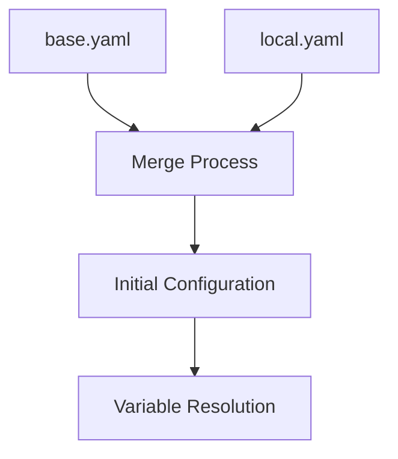

# Configuration Compilation Process

## Overview

The configuration compilation process is a crucial feature of this reference architecture. It transforms your environment-specific YAML configuration into a validated, resolved JSON format that Terragrunt can use. This process ensures consistency, validates all settings, and handles environment variables and secrets before any infrastructure changes are made.

## Why Configuration Compilation Matters

### 1. Validation Before Execution

- Catches configuration errors early
- Validates all required fields
- Ensures provider configurations are complete
- Verifies stack structure integrity

### 2. Security and Secret Management

- Resolves environment variables safely
- Handles sensitive information properly
- Prevents accidental secret exposure
- Manages provider credentials securely

### 3. Configuration Consistency

- Merges base and environment configurations
- Resolves all variable references
- Ensures complete configuration state
- Prevents partial or invalid deployments

## The Compilation Process

### 1. Configuration Loading



1. **Base Configuration**

   - Loads `base.yaml` as foundation
   - Contains shared settings
   - Defines default values

2. **Environment Override**
   - Loads environment-specific file (e.g., `local.yaml`)
   - Overrides base settings
   - Adds environment-specific values

### 2. Variable Resolution

The compilation process handles various types of variable references:

```yaml
# Example from local.yaml
providers:
  aws:
    config:
      access_key_id: ${AWS_ACCESS_KEY_ID:-secrets.aws.access_key_id}
      secret_access_key: ${AWS_SECRET_ACCESS_KEY:-secrets.aws.secret_access_key}
      region: us-east-1
```

Resolution Types:

1. **Direct Environment Variables**

   ```yaml
   region: ${AWS_REGION}
   ```

2. **Environment Variables with Defaults**

   ```yaml
   region: ${AWS_REGION:-us-east-1}
   ```

3. **Secret References**
   ```yaml
   api_key: ${API_KEY:-secrets.provider.api_key}
   ```

### 3. Configuration Validation

The compilation process validates:

1. **Required Sections**

   ```yaml
   # All these sections must be present and valid
   config: # Version and metadata
   git: # Repository settings
   product: # Product information
   iac: # Infrastructure as Code settings
   stacks: # Stack definitions
   providers: # Provider configurations
   ```

2. **Provider Configurations**

   ```yaml
   providers:
     aws:
       config: # Must have required fields
       version_constraints:
         - name: aws # Must specify version info
           source: "hashicorp/aws"
           required_version: "5.80.0"
   ```

3. **Stack Structure**
   ```yaml
   stacks:
     - name: stack-datastore # Must be unique
       layers:
         - name: db # Must be unique within stack
           components:
             - name: dynamodb # Must be unique within layer
               providers: # Must reference valid providers
                 - "aws"
   ```

### 4. Compilation Output

The process generates a compiled JSON file:

```bash
infra/.infractl-cache/config-compiled-local-<UUID>.json
```

Example compiled structure:

```json
{
  "config": {
    "version": "1.0.0",
    "last_updated": "2024-01-15"
  },
  "providers": {
    "aws": {
      "config": {
        "access_key_id": "ACTUAL_RESOLVED_VALUE",
        "region": "us-east-1"
      }
    }
  },
  "stacks": [
    {
      "name": "stack-datastore",
      "layers": [...]
    }
  ]
}
```

## Using Compiled Configuration

### 1. Environment Variables

The compilation process sets:

```bash
INFRACTL_CONFIG_FILE=config-compiled-local-<UUID>.json
INFRACTL_CONFIG_FILE_PATH=/path/to/infra/.infractl-cache/config-compiled-local-<UUID>.json
```

### 2. Terragrunt Integration

Terragrunt reads the compiled configuration through:

```hcl
# config.hcl
locals {
  config_file = jsondecode(file(get_env("INFRACTL_CONFIG_FILE_PATH")))
}
```

## Best Practices

### 1. Configuration Management

- Keep environment-specific values in appropriate YAML files
- Use base.yaml for shared settings
- Document all configuration options
- Version control your configurations

### 2. Secret Handling

- Never commit sensitive values
- Use environment variables for secrets
- Leverage secret references in configuration
- Document required environment variables

### 3. Validation

- Always run validation before deployment
- Check compiled output for correctness
- Monitor for configuration drift
- Keep configurations DRY

## Troubleshooting

### Common Issues

1. **Missing Environment Variables**

   ```yaml
   # Problem:
   access_key: ${AWS_ACCESS_KEY_ID}  # Environment variable not set

   # Solution:
   access_key: ${AWS_ACCESS_KEY_ID:-default_value}  # Add default
   ```

2. **Invalid Provider References**

   ```yaml
   # Problem:
   providers:
     - "invalid_provider"  # Provider not defined

   # Solution:
   providers:
     - "aws"  # Use defined provider
   ```

3. **Stack Structure Issues**

   ```yaml
   # Problem:
   stacks:
     - name: my-stack
       # Missing required 'layers' section

   # Solution:
   stacks:
     - name: my-stack
       layers:
         - name: my-layer
           components: []
   ```

### Resolution Steps

1. **Configuration Errors**

   - Run `infractl validate`
   - Check error messages
   - Verify YAML syntax
   - Ensure all required fields

2. **Variable Resolution**

   - Check environment variables
   - Verify secret references
   - Review default values
   - Validate provider settings

3. **Compilation Issues**
   - Clear cache directory
   - Rerun validation
   - Check file permissions
   - Review JSON output

## Example: Complete Configuration Flow

```bash
# 1. Set up environment variables
export AWS_ACCESS_KEY_ID="your-access-key"
export AWS_SECRET_ACCESS_KEY="your-secret-key"

# 2. Validate configuration
infractl validate --target-env=local

# 3. Review compiled configuration
cat $INFRACTL_CONFIG_FILE_PATH

# 4. Deploy infrastructure
infractl plan --stack=stack-datastore --target-env=local
infractl apply --stack=stack-datastore --target-env=local
```

This compilation process ensures that your infrastructure deployments are consistent, secure, and properly validated before any changes are made to your infrastructure.
