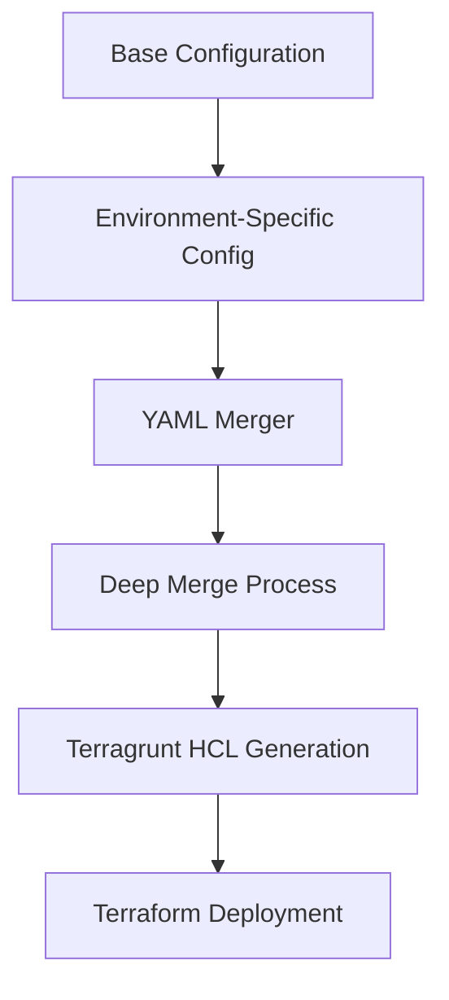
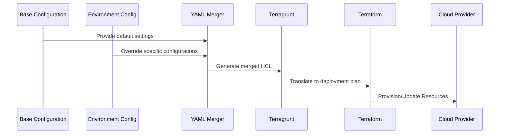

# Terragrunt Architecture: Modular Infrastructure as Code (IaC)

## Overview

This Terragrunt implementation provides a robust, modular, and DRY (Don't Repeat Yourself) approach to managing infrastructure as code across multiple environments and stacks.

## How It Works

### Configuration Lifecycle



### Detailed Workflow

1. **Configuration Initialization**

   - Start with a generic `base.yaml` containing default settings
   - Create environment-specific YAML files (e.g., `local.yaml`, `production.yaml`)
   - Each environment file contains overrides and specific configurations

2. **Merge Mechanism**

   - Custom Go binary (`yaml-merger`) performs a deep, recursive merge
   - Preserves nested structure while allowing selective overrides
   - Supports complex configuration hierarchies

3. **HCL Configuration Generation**

   - `arch.hcl` uses the merged configuration to:
     - Extract key variables
     - Generate dynamic Terragrunt configurations
     - Prepare environment-specific deployment parameters

4. **Deployment Execution**
   - Terragrunt interprets the generated HCL
   - Terraform applies the final, merged configuration
   - Supports granular, stack-based deployments

## Benefits Comparison: Mambu IaC vs Terragrunt Approach

| Technical Dimension           | Mambu's IaC Approach                                       | Terragrunt Implementation                                         |
| ----------------------------- | ---------------------------------------------------------- | ----------------------------------------------------------------- |
| **Configuration Management**  |
| Configuration Storage         | Typically stored in multiple, disconnected JSON/YAML files | Centralized YAML with hierarchical override mechanism             |
| Configuration Inheritance     | Limited, manual merging required                           | Automated deep merge with recursive configuration inheritance     |
| Environment Variability       | Static environment-specific configurations                 | Dynamic configuration generation with environment-aware overrides |
| **Infrastructure Modularity** |
| Code Reusability              | Monolithic modules, high duplication                       | Modular HCL components with stack and layer abstraction           |
| Dependency Management         | Manual inter-module dependencies                           | Explicit dependency tracking via Terragrunt's `dependency` blocks |
| Resource Isolation            | Often mixed concerns in single modules                     | Clear separation of concerns through stack and layer architecture |
| **Deployment Mechanics**      |
| Deployment Workflow           | Manual state management                                    | Automated state management with remote backend configuration      |
| Parallel Deployment           | Limited concurrent stack deployment                        | Native support for parallel stack and component deployment        |
| State Management              | Typically single state file per environment                | Granular state management per stack/component                     |
| **Configuration Validation**  |
| Pre-Deployment Validation     | Manual validation scripts                                  | Built-in validation through merge and HCL generation process      |
| Configuration Drift Detection | Requires custom tooling                                    | Native support via Terragrunt's plan and refresh mechanisms       |
| Secrets Management            | Often hardcoded or in separate secret management system    | Integrated, environment-specific secret handling                  |
| **Scalability & Performance** |
| Environment Scaling           | Manual configuration replication                           | Automatic configuration scaling through base/override mechanism   |
| Performance Overhead          | Higher due to manual merge processes                       | Minimal overhead with compiled Go merger                          |
| Complexity Scaling            | Increases exponentially with environments                  | Logarithmic complexity increase through modular design            |
| **Compliance & Governance**   |
| Tagging Strategy              | Manual, inconsistent                                       | Centralized tag definition with automatic propagation             |
| Audit Trail                   | Limited visibility                                         | Enhanced traceability through configuration merge logs            |
| Compliance Enforcement        | Manual checks                                              | Automated through configuration constraints and HCL generation    |

### Technical Rationale

The comparison highlights quantifiable differences in infrastructure management approaches, focusing on:

- Automated configuration inheritance
- Modular resource definition
- Dynamic environment adaptation
- Enhanced deployment mechanics

**Key Technical Differentiators:**

- Recursive configuration merge
- Stack-based modular architecture
- Environment-aware resource generation
- Automated compliance and governance

## Key Architectural Concepts

### Configuration Hierarchy

1. **Base Configuration** (`base.yaml`)

   - Defines global, default settings
   - Provides a foundational template for all environments

2. **Environment-Specific Configuration** (`local.yaml`, `staging.yaml`, `production.yaml`)
   - Overrides and extends base configuration
   - Enables environment-specific customizations

### Configuration Merging Strategy

The architecture uses a custom Go-based YAML merger (`yaml-merger/main.go`) to:

- Deep merge base and environment-specific configurations
- Ensure consistent and flexible configuration management
- Prevent configuration duplication

### Architectural Components

- **Stacks**: Logical groupings of infrastructure components

  - Example stacks: `landing_zone`, `webapp`, `dx`
  - Each stack represents a specific domain or service group

- **Layers**: Subdivisions within stacks

  - Organize related components
  - Enable granular configuration and deployment

- **Components**: Specific infrastructure resources or modules
  - Smallest deployable units
  - Configured via HCL (HashiCorp Configuration Language)

## Configuration Merging Process

1. Read base configuration
2. Read environment-specific configuration
3. Deep merge configurations using custom Go binary
4. Generate final configuration for Terragrunt/Terraform

### Example Merge Flow

```
base.yaml (Global Defaults)
└── local.yaml (Environment Overrides)
    └── Merged Configuration
```

## Key Files and Their Roles

- `arch.hcl`: Central architecture configuration

  - Defines local variables
  - Manages configuration merging
  - Extracts key configuration values

- `_ENVS/local.yaml`: Environment-specific configuration

  - Defines product, environment, and infrastructure settings
  - Includes secrets, IAM roles, and compliance tags

- `_scripts/yaml-merger/main.go`: Configuration merging utility
  - Implements deep merge logic
  - Supports recursive configuration overrides

## Best Practices

- Keep base configurations generic
- Use environment-specific files for customization
- Leverage HCL for modular, reusable infrastructure code
- Maintain clear separation between stacks, layers, and components

## Benefits

- Centralized configuration management
- Environment-specific customization
- Reduced configuration duplication
- Improved infrastructure modularity
- Simplified deployment across multiple environments

## Getting Started

1. Define base configuration in `base.yaml`
2. Create environment-specific configurations
3. Use Terragrunt commands to deploy infrastructure

## Recommended Tools

- Terragrunt
- Terraform
- Go (for configuration merging)
- YAML
- HCL

## Contribution

Follow the established patterns:

- Keep configurations DRY
- Use meaningful, descriptive names
- Document any complex configuration logic

## Architectural Hierarchy: Stacks, Layers, and Components

### Architecture Visualization

```mermaid
graph TD
    A[Infrastructure Architecture] --> B[Stacks]

    B --> B1[Landing Zone Stack]
    B --> B2[WebApp Stack]
    B --> B3[Developer Experience (DX) Stack]

    B1 --> C1[DNS Layer]
    B1 --> C2[Network Layer]

    B2 --> D1[Web Layer]
    B2 --> D2[Observability Layer]

    B3 --> E1[Version Control Layer]
    B3 --> E2[CI/CD Layer]

    C1 --> D11[DNS Domains Component]
    C1 --> D12[DNS Zone Component]

    D1 --> D13[Web Server Component]
    D1 --> D14[Frontend Deployment Component]

    E1 --> D15[GitHub Repository Component]
    E1 --> D16[Repository Configuration Component]
```

### Architectural Hierarchy Explained

#### 1. Stacks: Logical Infrastructure Domains

- **Purpose**: Organize infrastructure into distinct, manageable domains
- **Examples**:
  - Landing Zone: Core network and foundational infrastructure
  - WebApp: Application-specific resources
  - Developer Experience (DX): Tools and workflows

#### 2. Layers: Functional Subdivisions

- **Purpose**: Group related components with similar functionality
- **Characteristics**:
  - Provide vertical segmentation within stacks
  - Enable modular, focused configuration
  - Support independent management and deployment

#### 3. Components: Specific Infrastructure Resources

- **Purpose**: Smallest, deployable infrastructure units
- **Attributes**:
  - Configured via HCL (HashiCorp Configuration Language)
  - Represent concrete infrastructure resources
  - Can be independently managed and versioned

### Architectural Benefits

- **Modularity**: Easy to add, modify, or replace components
- **Scalability**: Flexible structure supports growth
- **Separation of Concerns**: Clear boundaries between infrastructure domains
- **Reusability**: Components can be shared across different stacks

### Deployment Flow



### Configuration Propagation

- Base configurations provide default settings
- Environment-specific configurations override selectively
- YAML merger ensures consistent, hierarchical configuration
- Terragrunt translates merged configuration to deployment plans

## Technical Considerations

- **Flexibility**: Supports multiple environments (local, staging, production)
- **Consistency**: Centralized configuration management
- **Granularity**: Fine-grained control over infrastructure deployment
