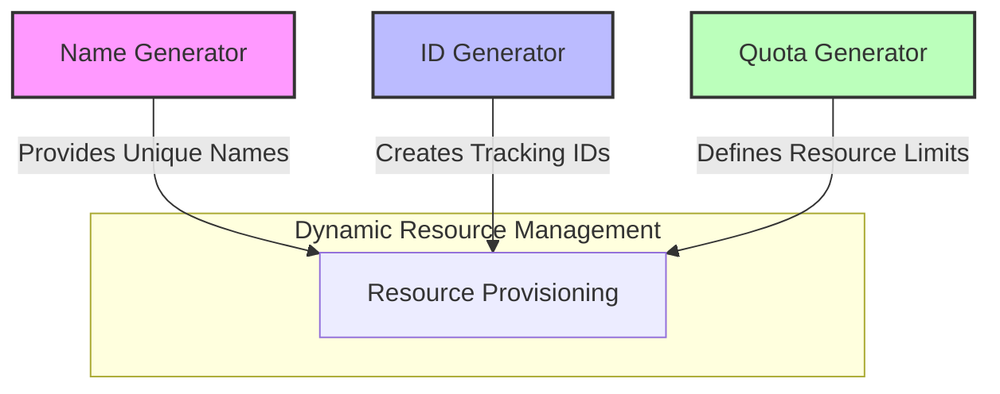

# Dynamic Resource Generation Layer

## Overview

This layer demonstrates a flexible, modular approach to generating dynamic resources using Terraform's random provider. It showcases how infrastructure components can be dynamically configured with unique identifiers, names, and quotas.

## Components

### 1. Name Generator

- **Purpose**: Generate unique, configurable resource names
- **Resource**: `random_string`
- **Key Features**:
  - Customizable string length
  - Character composition control
  - Optional name templating

### 2. ID Generator

- **Purpose**: Create unique tracking identifiers
- **Resource**: `random_uuid`
- **Key Features**:
  - UUID generation with optional formatting
  - Prefix/suffix support
  - Regeneration control

### 3. Quota Generator

- **Purpose**: Dynamically allocate resource quotas
- **Resource**: `random_integer`
- **Key Features**:
  - Configurable quota ranges
  - Scaling and adjustment options
  - Percentage calculation

## Dependency Diagram



## Use Cases

### 1. Cloud Resource Naming

```hcl
module "web_service" {
  source = "./name-generator"
  prefix_length = 6
  name_template = "webservice-%s-instance"
}
# Result: webservice-a3x9k2-instance
```

### 2. Deployment Tracking

```hcl
module "deployment_id" {
  source = "./id-generator"
  id_type = "deployment"
  uuid_prefix = "myapp"
}
# Result: myapp-<unique-uuid>
```

### 3. Dynamic Quota Allocation

```hcl
module "user_quota" {
  source = "./quota-generator"
  min_quota = 50
  max_quota = 200
  quota_type = "concurrent_users"
  scale_factor = 1.5
}
# Result: Dynamically generated quota between 50-200
```

## Architectural Principles

- **Modularity**: Each component is a standalone Terraform module
- **Configurability**: Extensive input variables for customization
- **Predictability**: Controlled randomness with keeper mechanisms
- **Traceability**: Unique identifiers for resource tracking

## Best Practices

- Use `keepers` to control resource regeneration
- Leverage optional formatting and scaling
- Implement consistent naming conventions
- Use tags for resource identification

## Requirements

- Terraform >= 1.9.8
- Random Provider ~> 3.6.3

## Potential Expansions

- Integration with cloud provider resource creation
- Advanced naming conventions
- More complex quota allocation strategies
