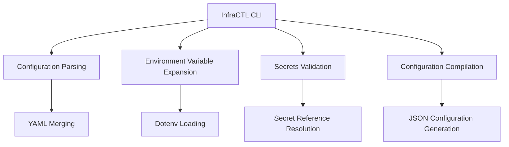

## 🛠 Technical Architecture

### CLI Tool Structure



### Key Technical Components

1. **Configuration Parsing**

   - Uses `gopkg.in/yaml.v3` for advanced YAML processing
   - Supports deep configuration merging
   - Handles nested configuration structures

2. **Environment Variable Expansion**

   - Supports `${VAR}` and `${VAR:-default}` patterns
   - Recursive environment variable resolution
   - Secure variable extraction mechanisms

3. **Secrets Management**

   - Provider-specific secret validation
   - Centralized secret configuration
   - Nested secret reference support
   - Prevents deployment with incomplete secrets

4. **Configuration Compilation**
   - Merges base and environment-specific configurations
   - Generates validated JSON configurations
   - Ensures Terragrunt receives clean, validated config

## 🔍 Advanced Features

### Environment Variable Handling

```bash
# Supports complex variable expansion
${AWS_REGION:-us-east-1}
${SECRET_KEY:-secrets.aws.access_key}
```

### Secret Reference Mechanism

```yaml
secrets:
  aws:
    access_key: ${AWS_ACCESS_KEY_ID}
    secret_key: ${AWS_SECRET_ACCESS_KEY}
```

## 📦 Getting Started

### Prerequisites

- Go 1.20+
- Terragrunt
- Terraform

### Quick Installation

```bash
# Clone the repository
git clone https://github.com/Excoraite/terragrunt-ref-arch-v2.git

# Build the InfraCTL CLI
cd tools/infractl
go build -o infractl

# Validate configuration
./infractl validate --target-env local
```

## 🛠 Supported Workflows

```bash
# Validate configuration
infractl validate --target-env local --stack stack-datastore

# Plan infrastructure changes
infractl plan --target-env local \
    --stack stack-datastore \
    --layer db \
    --component quota-generator

# Apply infrastructure
infractl apply --target-env local \
    --stack stack-datastore
```

## 🔗 Key Dependencies

- `gopkg.in/yaml.v3`: YAML Processing
- `github.com/joho/godotenv`: Dotenv Loading
- `github.com/alecthomas/kong`: CLI Parsing
- `github.com/charmbracelet/log`: Logging
